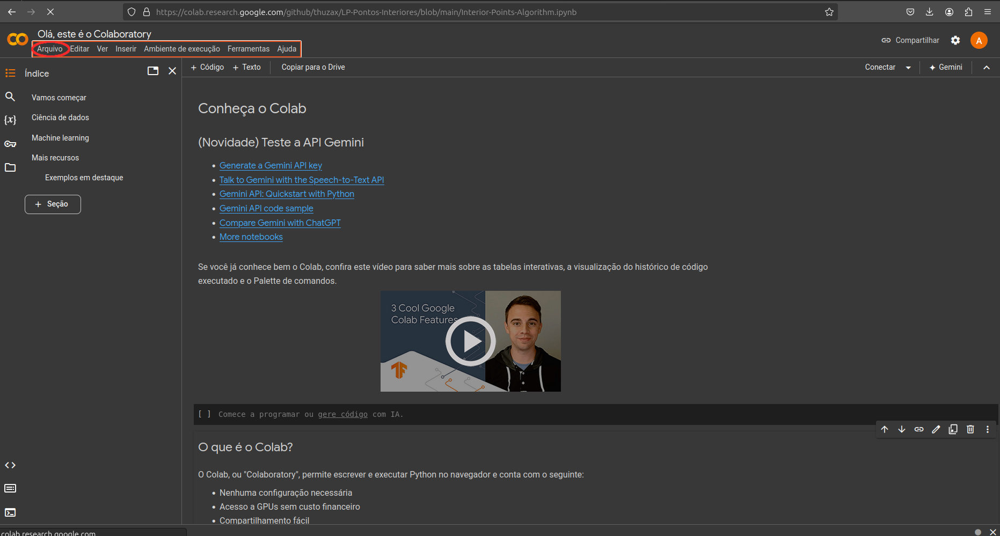
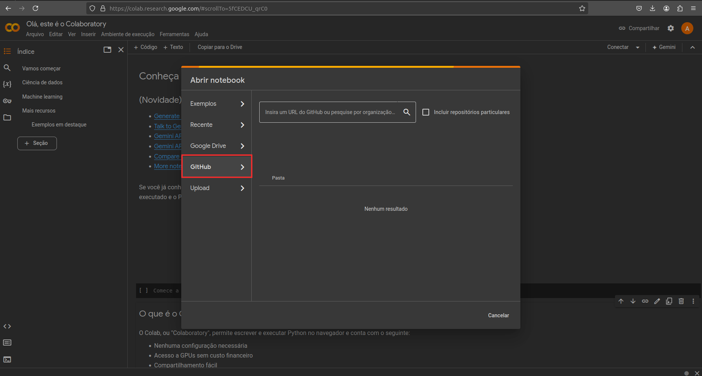
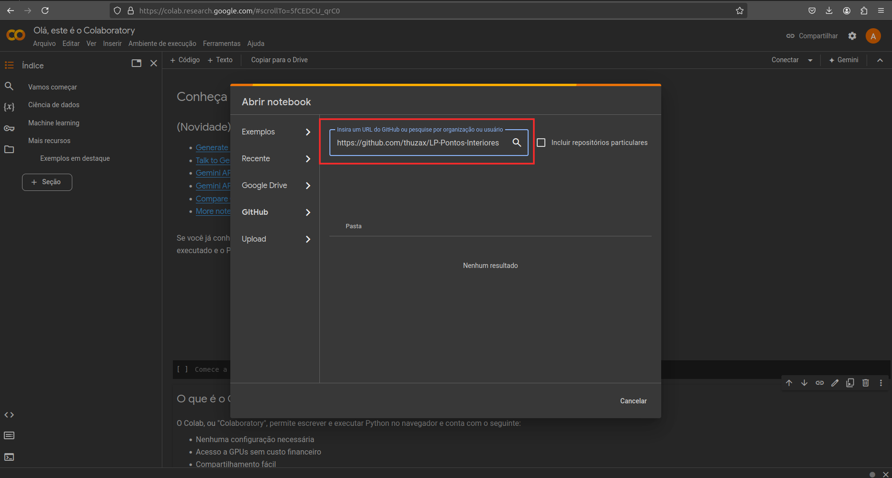

# Pontos Interiores para Problemas Lineares

Este trabalho implementa o algoritmo de Pontos Interiores utilizando o Sistema Normal para a busca das direções das soluções. Além disso, foi implementado o método de adição de restrição artificial para identificação do caso ilimiteado.

Como o objetivo era a implementação para fins didáticos, ela foi feita utilizando o *jupyter-notebook*. O código-fonte pode ser visto [neste arquivo](Interior-Points-Algorithm.ipynb).

Além da implementação é apresentado um conjunto de exemplos e, para casos com até duas variáveis, a representação gráfica das soluções obtidas.

## Licensa de uso

Este projeto foi desenvolvido sob a licença MIT. A licença é descrita [neste arquivo](LICENSE).

## Requisitos

Para utilizar o programa são necessárias as seguintes bibliotecas:

* numpy
* json
* matplotlib

## Guia de instalação

### Jupyter-Notebook

Caso deseje utilizar o jupyter-notebook para executar o algoritmo, basta clonar (ou baixar) esse repositório e executar o seguinte comando no diretório do projeto:

```jupyter-notebook```

Em seguida, selecione o arquivo *Interior-Points-Algorithm.ipynb*.

### Google colab

Vá em "Arquivo" e selecione a opção "Abrir notebook". Em seguida, no menu a esquerda, escolha a opção Github e digite o link deste github (https://github.com/thuzax/LP-Pontos-Interiores) na barra de busca. Por fim, selecione o arquivo *Interior-Points-Algorithm.ipynb*. As Figuras abaixo ilustram o processo:







## Autores

Arthur Henrique Sousa Cruz ([ver currículo lattes](http://lattes.cnpq.br/7792617711548023)) $-$ Github: [thuzax](https://github.com/thuzax)


Walison Adrian de Oliveira ([ver currículo Lattes](http://lattes.cnpq.br/5950090124404335))